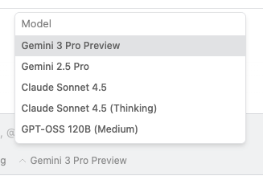

# 모델

## 추론 모델 (Reasoning Model)

핵심 추론 모델의 경우, Antigravity는 Gemini Enterprise Agent Platform의 선도적인 프론티어 모델들을 제공합니다:

* Gemini 3.5 Flash  
* Gemini 3.1 Pro (high)  
* Gemini 3.1 Pro (low)  
* Gemini 3 Flash  
* Claude Sonnet 4.6 (thinking)  
* Claude Opus 4.6 (thinking)  
* GPT-OSS-120b

사용자는 대화 프롬프트 입력창 아래에 있는 모델 선택기 드롭다운을 통해 사용하고자 하는 추론 모델을 선택할 수 있습니다:

선택한 추론 모델은 대화 내에서 사용자 메시지 간에 고정(sticky)되어 적용됩니다. 따라서 에이전트가 실행 중일 때 추론 모델을 변경하더라도, 해당 사용자 턴의 단계를 모두 완료하거나 현재 실행을 취소하기 전까지는 이전에 선택된 추론 모델을 계속 사용합니다.

추론 모델 요금 제한에 대해 자세히 알아보려면 [요금제 페이지](../plans.md)를 참조하세요.

## 기타 모델

Antigravity는 커스텀할 수 없는 스택의 다양한 부분에서 여러 다른 모델들을 사용합니다:

* **Nano Banana 2**: 에이전트가 UI 목업을 제작하거나, 웹 페이지 또는 애플리케이션을 채우기 위한 이미지가 필요하거나, 시스템 또는 아키텍처 다이어그램을 생성하는 등 이미지 생성 작업을 수행하고자 할 때 이미지 생성 도구에서 사용됩니다.
